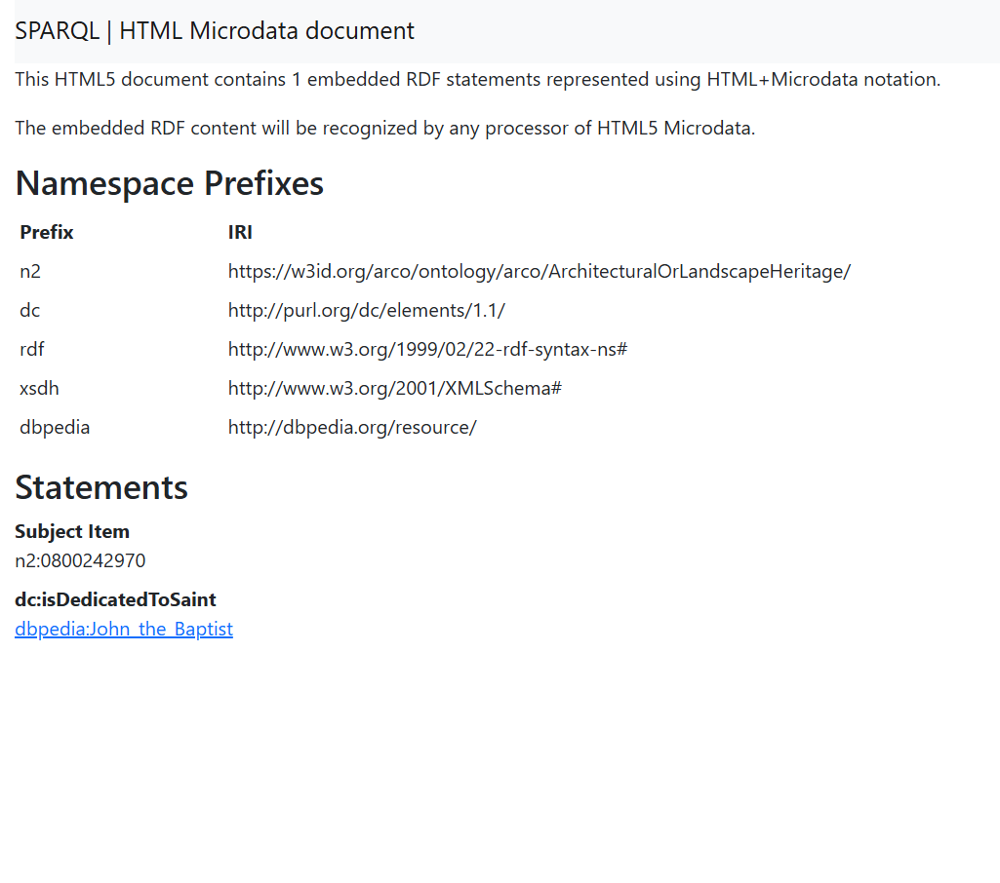

# REPORT

## Index

1. [Methodology](#1-methodology)
   
2. [Immovable Cultural Property _Basilica di Santo Stefano_](#2-immovable-cultural-property-basilica-di-santo-stefano)
   
3. [Immovable Cultural Property _Basilica di Santa Maria dei Servi_](#3-immovable-cultural-property-basilica-di-santa-maria-dei-servi)


## 1. Methodology

### General methodology 
* Making hypotheses
* Looking for the vocabulary in the ArCo ontologies documentation
* Realizing queries using the ArCo SPARQL endpoint
* Verifying if the retrieved data could actually back up our hypotheses or not
* Using Large Language Models 
* Creating RDF triples that could be addeded to the knowledge graph

### How was the gap identified?
* Starting from more explorative and generic queries 
* Checking the RDF description of the retrieved data
* Looking for missing information 

### Tools used
* ArCo as the main Knowledge Graph
* Dbpedia to enrich ArCo
* SPARQL SELECT and CONSTRUCT 
* ChatGpt, Gemini and Mistral


## 2. Immovable Cultural Property _Basilica di Santo Stefano_

### Step 1

We chose the _Basilica di Santo Stefano_ as our first topic. We examined the ArCo ontology to see to which class the churches belong and we found two classes: a more general one (arco:ImmovableCulturalProperty) and a more specific one (arco:ArchitecturalOrLandscapeHeritage). We chose "ImmovableCulturalProperty". Then, we did the first query in order to find the _Basilica di Santo Stefano_ on ArCo, and we also employed the keyword **DISTINCT** to be sure not to have any duplicates in the results.

```js
PREFIX rdf: <http://www.w3.org/1999/02/22-rdf-syntax-ns#>
PREFIX rdfs: <http://www.w3.org/2000/01/rdf-schema#>
PREFIX arco: <https://w3id.org/arco/ontology/arco/>

SELECT DISTINCT*
WHERE {
?s a arco:ImmovableCulturalProperty; 
rdfs:label ?label.
FILTER (?label = "Basilica di Santo Stefano") 
}
```
We obtained no results.

### Step 2

Since we did not get any results, we made the query more generic by looking for an Immovable Cultural Property related to “Santo Stefano” in the city of “Bologna”. In order to do so, we used the keywords **FILTER** and **REGEX** to obtain results containing these substrings. 

```js
PREFIX rdf: <http://www.w3.org/1999/02/22-rdf-syntax-ns#>
PREFIX rdfs: <http://www.w3.org/2000/01/rdf-schema#>
PREFIX arco: <https://w3id.org/arco/ontology/arco/>
PREFIX dc: <http://purl.org/dc/elements/1.1/>

SELECT DISTINCT*
WHERE {
?cp a arco:ImmovableCulturalProperty;
rdfs:label ?label;
dc:coverage ?coverage.
FILTER(
REGEX(?label, "santo Stefano", "i") &&
REGEX(?coverage, "Bologna", "i"))
}
```
We obtained no results.

### Step 3

Still not obtaining any results, we decided to base our research on the address “Piazza Santo Stefano” in order to find the buildings located there. We asked the LLMs to write a query to retrieve this information with the **chain-of-thought prompting technique**.
* _Question: You are given the following ontology terms from ArCo:_
  _clv:Address (class of addressable objects)_
  _rdfs:label (data property linking an entity to its label)_
     * _Task: Write a SPARQL query to find the Address of Piazza Santo Stefano in Bologna using Turtle syntax. Let’s think step by step._

#### ChatGPT


#### Gemini


#### Mistral


Analysing the LLMs results we noticed that:
* Mistral did not use ArCo’s properties and did not filter the label;
* Gemini did not filter the label;
* ChatGpt correctly used ArCo’s properties that we provided and used the double FILTER to find the square in Bologna. Therefore, we employed the following query:

```js
PREFIX clv: <https://w3id.org/italia/onto/CLV/>
PREFIX rdfs: <http://www.w3.org/2000/01/rdf-schema#>

SELECT ?address
WHERE {
  ?address a clv:Address ;
           rdfs:label ?label .
FILTER(
CONTAINS(LCASE(?label), "piazza santo stefano") && CONTAINS(LCASE(?label), "bologna"))
}
```

We obtained two IRIs as a result:
* [IRI address Piazza Santo Stefano](https://w3id.org/arco/resource/Address/4e1342b28cd0daeca522227839eef00c)
* [IRI andress Piazza Santo Stefano, 9c](https://w3id.org/arco/resource/Address/25eaafb6aff66c718f77be5407be8755)

Both these IRIs refer to the adress of Piazza Santo Stefano, but the former is more general than the latter. Therefore, we checked their RDF pages, and knowing that the _Basilica di Santo Stefano_ is a complex of churches, we noticed that there is no entity representing the Santo Stefano complex as a whole, but the various churches that form the Basilica are listed separately.

#### SUGGESTION 

To enrich ArCo, it would be useful to add a single entity that represents the entire complex with its own IRI and to link it to the corresponding entity on DBpedia ([IRI DBpedia Basilica di Santo Stefano](https://dbpedia.org/resource/Santo_Stefano,_Bologna)) by using the property **owl:sameAs**.

### Step 4

Among the churches in _Piazza Santo Stefano_ that form part of the Basilica, we chose _Chiesa del Crocifisso_, and by analyzing its RDF page, we noticed that among the missing information there is the saint to whom it is dedicated.

We asked the LLMs to find the saint to whom the _Chiesa del Crocifisso_ is dedicated with the **zero-shot prompting technique**. According to our investigations, we discovered that it is dedicated to San Giovanni Battista.
* _Question: To whom is dedicated Chiesa del Crocifisso in Piazza Santo Stefano in Bologna?_

#### ChatGPT


#### Gemini


#### Mistral


Analysing the results we noticed that Gemini answered correctly with “San Giovanni Battista” while both Mistral and ChatGpt provided wrong answers.

### Step 5

We wrote a query in order to find the IRI of _San Giovanni Battista_ on ArCo. We also employed the keyword **ORDER BY ASC** to have more organized results.

```js
PREFIX cpv: <https://w3id.org/italia/onto/CPV/>
PREFIX rdfs: <http://www.w3.org/2000/01/rdf-schema#>
SELECT DISTINCT*
WHERE {
?agent a cpv:Person;
rdfs:label ?label
FILTER(REGEX(?label, "Giovanni Battista", "i"))
}
ORDER BY ASC (?label)
```
We are provided with hundreds of results that don’t match with the entity that we were looking for (they were all referring to people, not to the saint).


#### SUGGESTION

To enrich the knowledge graph it would be useful to create an IRI on ArCo to identify _San Giovanni Battista_.

### Step 6

Therefore, we imported from DBpedia the IRI of _San Giovanni Battista_: [IRI DBpedia Giovanni Battista](https://dbpedia.org/page/John_the_Baptist). Then we used a **SPARQL CONSTRUCT** query to create a new property in order to describe the relationship between the church and the saint to whom it is dedicated, obtaining a new triple that can enhance ArCo’s knowledge graph. We chose the **a-cd prefix** because we assumed we could find this kind of information in the context description ontology.

```js
PREFIX a-cd: <https://w3id.org/arco/ontology/context-description/>
PREFIX alh: <https://w3id.org/arco/ontology/arco/ArchitecturalOrLandscapeHeritage/>
PREFIX dbr: <http://dbpedia.org/resource/>
CONSTRUCT {
alh:0800242970 a-cd:isDedicatedToSaint dbr:John_the_Baptist
}
WHERE {
}
```

As a result we obtained this new triple:




## 3. Immovable Cultural Property _Basilica di Santa Maria dei Servi_

### Step 1

For the second topic we started from _Basilica di San Petronio_. We ran a query in order to find it on ArCo:

```js
PREFIX rdf: <http://www.w3.org/1999/02/22-rdf-syntax-ns#>
PREFIX rdfs: <http://www.w3.org/2000/01/rdf-schema#>
PREFIX arco: <https://w3id.org/arco/ontology/arco/>
SELECT DISTINCT*
WHERE {
?cp a arco:ArchitecturalOrLandscapeHeritage; 
rdfs:label ?label.
FILTER(
REGEX(?label, "San Petronio", "i") &&
REGEX(?label, "basilica", "i"))
}
```
We obtained 2 results, one in English and the other in Italian, referring to the same entity: [IRI Basilica di San Petronio](https://w3id.org/arco/resource/ArchitecturalOrLandscapeHeritage/0800135039)

From the RDF page of San Petronio we found the two artists that designed it and took their IRIs: 
* [IRI Andrea da Faenza](https://w3id.org/arco/resource/Agent/1225a7cd56d844001bb0d0256259ab63)
* [IRI Di Vincezo Antonio](https://w3id.org/arco/resource/Agent/2cfcbabdc54b72ed32e2a9d0b2a4538a)

### Step 2
We formulated a query in order to find their other works. We used the following keywords: **UNION** to find the works of either artists, **OPTIONAL** to show us any possible images, **LIMIT** to set a limit and **ORDER BY ASC** to list the results in alphabetical order.

```js
PREFIX rdfs: <http://www.w3.org/2000/01/rdf-schema#>
 PREFIX arco: <https://w3id.org/arco/ontology/arco/>
 PREFIX a-cd: <https://w3id.org/arco/ontology/context-description/>
 PREFIX agent: <https://w3id.org/arco/resource/Agent/>
PREFIX a-cd: <https://w3id.org/arco/ontology/context-description/>
SELECT DISTINCT*
WHERE {

?cp a arco:ArchitecturalOrLandscapeHeritage;
rdfs:label ?label
{ ?cp a-cd:hasAuthor agent:1225a7cd56d844001bb0d0256259ab63 }
UNION
{ ?cp a-cd:hasAuthor agent:2cfcbabdc54b72ed32e2a9d0b2a4538a }
OPTIONAL { ?cp a-cd:depiction ?depiction }
}
ORDER BY ASC (?label)
LIMIT 20
```
We obtained 12 results, half of which are in English and half in Italian, with the same IRIs.
The results concerned only one of the two authors, Antonio di Vincenzo, and we did not get any images.


### Step 3

Among all the results we chose _Chiesa di Santa Maria dei Servi_ ([IRI of the church](https://w3id.org/arco/resource/ArchitecturalOrLandscapeHeritage/0800108309)).
In the RDF description of the church we noticed that there are no links to the artworks that can be found within it.

According to our previous investigations we discovered that there are many paintings within the church. We queried the LLMs about the paintings with a **zero-shot prompting technique**.

* _Question: Which are the paintings exhibited in Chiesa di Santa Maria dei Servi in Bologna?_

#### ChatGPT


#### Gemini 


#### Mistral


All of the Large Language Models responded correctly, providing the titles of paintings actually contained in the church. However, none of them provided an exhaustive list: 
* Mistral was more general by grouping frescos from different authors
* Gemini and ChatGpt listed only the works they considered most important

### Step 4

Among all the results, we chose Cimabue’s _Majesty_, also known as _La Madonna col bambino e angeli_ and we wanted to see if the painting existed on the ArCo system. To do so, we used the following query:

```js
PREFIX rdfs: <http://www.w3.org/2000/01/rdf-schema#>
 PREFIX arco: <https://w3id.org/arco/ontology/arco/>
 PREFIX a-cd: <https://w3id.org/arco/ontology/context-description/>
SELECT DISTINCT*
WHERE {
?cp a arco:HistoricOrArtisticProperty;
rdfs:label ?label;
a-cd:hasAuthor ?author.
?author rdfs:label ?authorlabel.
FILTER(
REGEX(?label, "Madonna", "i") &&
REGEX(?authorlabel, "Cenni di Pepo", "i"))
}
```
We got 10 results, half of which were in English. Between the given results there is the painting that we were looking for: [IRI painting](https://w3id.org/arco/resource/HistoricOrArtisticProperty/0800018958)


Checking its RDF description, we noticed that it is not linked to the _Chiesa di Santa Maria dei Servi_, where it is kept.

### Step 5

Therefore, we created a SPARQL query to search through the ArCo ontologies for a property that we could use to link this work of art to the church in which it is kept.

```js
PREFIX rdfs: <http://www.w3.org/2000/01/rdf-schema#>
PREFIX arco: <https://w3id.org/arco/ontology/arco/>
SELECT DISTINCT ?propertylocation
WHERE {
?culturalProperty a arco:HistoricOrArtisticProperty. 
?church a arco:ArchitecturalOrLandscapeHeritage.
?culturalProperty ?propertylocation ?church.
}
ORDER BY ASC (?propertylocation)
LIMIT 50
```
We obtained 7 results and between those we chose the one called **a-cd:isLocatedIn** ([IRI property isLocatedIn](https://w3id.org/arco/ontology/context-description/isLocatedIn)). This property, part of the “Context-Description” properties, links a cultural good to another related cultural good, which is its location.


### Step 6

Finally, we asked the LLMs Gemini, Mistral and ChatGpt to create a new triple that could express this relation. We used the **few-shot prompting technique** and provided two examples, hoping to achieve a more accurate output that would imitate our examples. Here is our question to the LLMs:

* _Question:_
   * Example 1
   
   Marte e Venere is kept in Palazzo Pamphilj, Roma (RM).

   RDF format:
   IRI Marte e Venere (dipinto) di Brandi Giacinto (bottega) (sec. XVII) = https://w3id.org/arco/resource/HistoricOrArtisticProperty/1201202323-8

   is kept in = a-cd:isLocatedIn = https://w3id.org/arco/ontology/context-description/isLocatedIn

   IRI Palazzo Pamphilij (palazzo) Roma (RM) = https://w3id.org/arco/resource/ArchitecturalOrLandscapeHeritage/1200480714

   HistoricOrArtisticProperty:1201202323-8  a-cd:isLocatedIn ArchitecturalOrLandscapeHeritage:1200480714

   * Example 2
   
   Assunzione della Madonna is kept in Chiesa di S. Maria Icona Vetere (chiesa, cattedrale), Foggia (FG).

   RDF format: 
   IRI Assunzione della Madonna (vetrata) di Milone G (sec. XX) = https://w3id.org/arco/resource/HistoricOrArtisticProperty/1600034809-10

   is kept in = a-cd:isLocatedIn = https://w3id.org/arco/ontology/context-description/isLocatedIn

  IRI Chiesa di S. Maria Icona Vetere (chiesa, cattedrale) - Foggia (FG) = https://w3id.org/arco/resource/ArchitecturalOrLandscapeHeritage/1600033242

   HistoricOrArtisticProperty:1600034809-10  a-cd:isLocatedIn ArchitecturalOrLandscapeHeritage:1600033242

   * _Task: Based on the previous example that I gave you, could you transform the following sentence “the record specifies that the painting “Madonna con Bambino (dipinto) di Cenni di Pepo detto Cimabue (sec. XIII) is kept in Chiesa di Santa Maria dei Servi (chiesa, basilicale) - Bologna (BO)" into RDF format using the ArCo ontology?_

#### ChatGPT


#### Gemini


#### Mistral


Analyzing the results we noticed that: 
* Gemini respected the structure that we provided but it used some variables instead of the IRIs;
* ChatGpt respected the structure that we provided but invented the IRIs;
* Mistral respected the structure that we provided, but used different prefixes to those indicated and invented the IRIs.

Since the LLMs results were not satisfactory we decided to provide our own triple: 
<https://w3id.org/arco/resource/HistoricOrArtisticProperty/0800018958> a-cd:isLocatedIn <https://w3id.org/arco/resource/ArchitecturalOrLandscapeHeritage/0800108309> }


[Final Step](./finalstep.md)

[Home](./)
